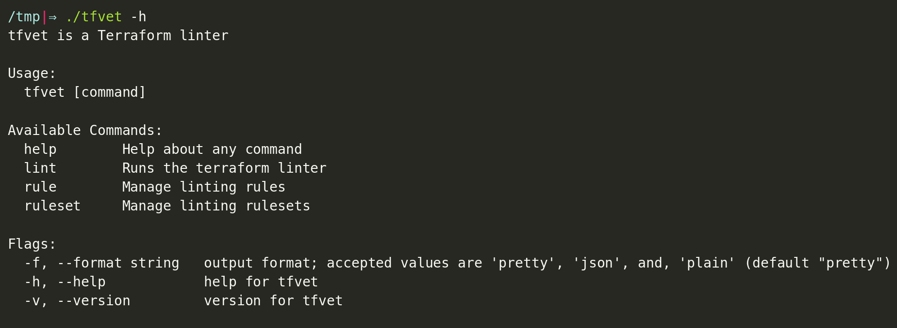

# HCL Vet (hclvet)

HCL vet is a simplistic, pluggable HCL linter.

<a href="https://asciinema.org/a/m4wZebEQZOfsLTcVHgZDTapFz">
    Click on image for demo
    
</a>

## Features

- Pluggable and configurable rules.
- Write simple, testable rules in golang, using simple data structures.
- Simple, intuitive command line interface.

## Install

### Download the binary:

- **Linux:** `wget https://github.com/clintjedwards/hclvet/releases/latest/download/hclvet`

### Go Install:

1. `git clone https://github.com/clintjedwards/hclvet && cd hclvet`
2. `go install`

### Build manually:

1. `git clone https://github.com/clintjedwards/hclvet && cd hclvet`
2. `go build -o <your_path_here>`

## How it works

HCLvet allows you to lint HCL files using pluggable rules written in golang. It's meant to offer
a simple, configurable interface that makes it easy to write and retrieve rules for.

### 1) Add a ruleset

Rules are packages into "rulesets" which can be added via the command line.

`$ hclvet ruleset add github.com/clintjedwards/hclvet-ruleset-example`

Rulesets usually package one or more linting rules and can be added from a variety of sources. You create
a local ruleset on your specific machine or download one from a remote source.

The example ruleset above contains a few rules that are used for testing.

### 2) Start linting files!

`$ hclvet lint`

By default hclvet looks into the local directory on run to find hcl files. This is easily changed by
adding a path or multiple paths. The path argument allows for file globbing:

`$ hclvet lint ./internal/testdata/*`

## How to create rules

Rules are grouped into packaging called rulesets. These rulesets can be added and removed from your local
hclvet linter as you see fit.

Find [how to create a new ruleset here.](sdk/README.md)

You can find an [example ruleset here.](https://github.com/clintjedwards/hclvet-ruleset-example)

## Application structure

- **internal**: All packages inside here are not meant to be consumed as a library.
  - **cli**: Main logic of the program; contains all logic that controls command line manipulation.
  - **config**: Controls application level environment variables.
  - **plugin**: Provides the go-plugin related structures that allow rules to act as plugins.
  - **testdata**: Contains artifacts used for testing.
  - **utils**: Common directory for piece of code used throughout.
- **sdk**: The software development toolkit that assists with creating rulesets and rules.

## Drawbacks

- The lint rules are designed to only consume one file at a time, they cannot alert on project wide errors.

## Author

- **Clint Edwards** - [Github](https://github.com/clintjedwards)
